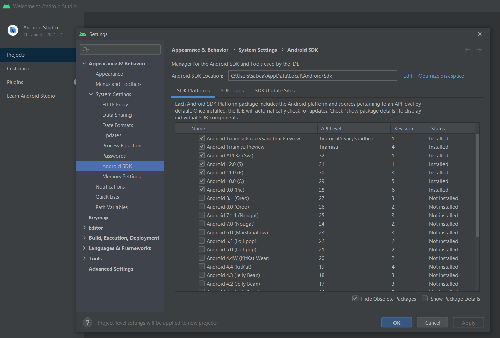
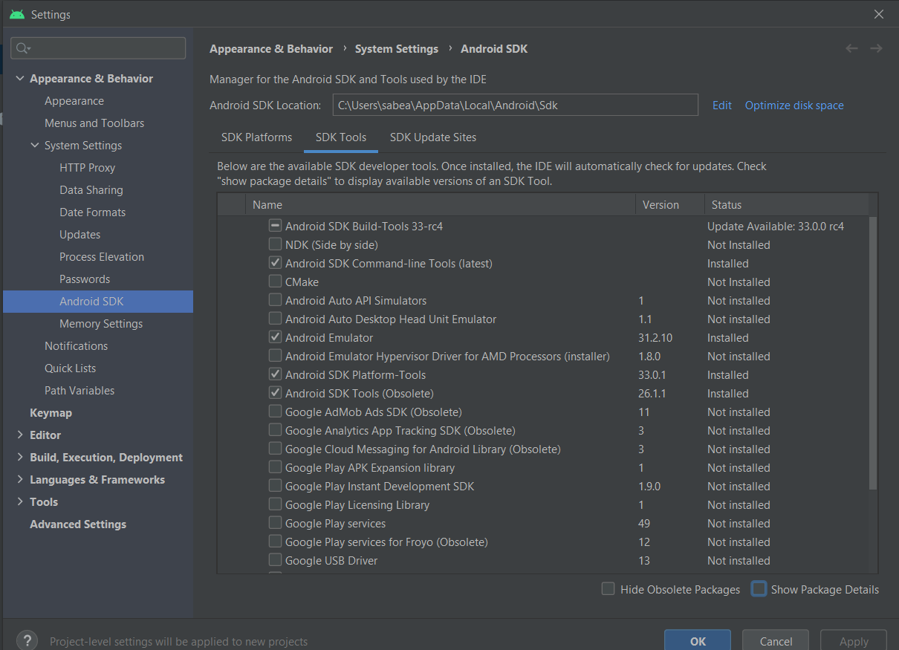
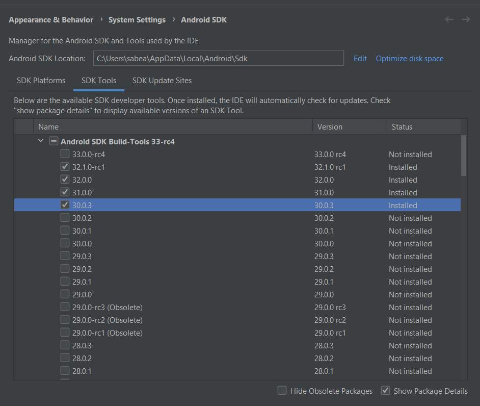
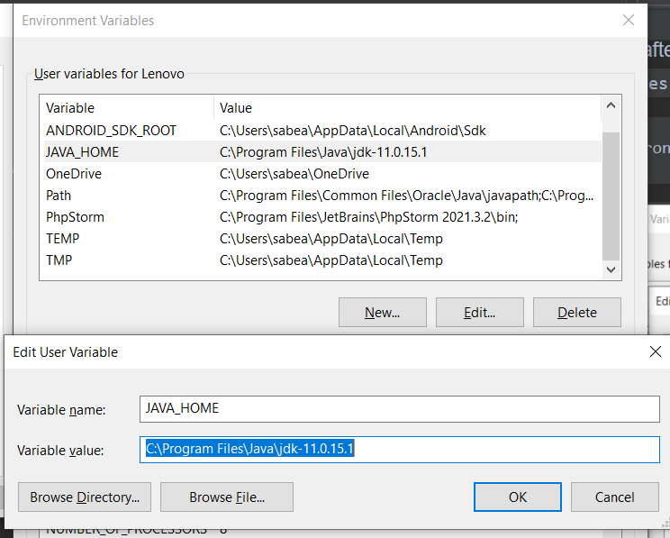
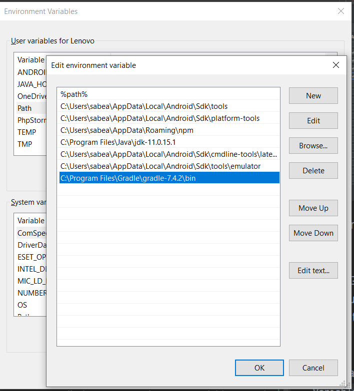
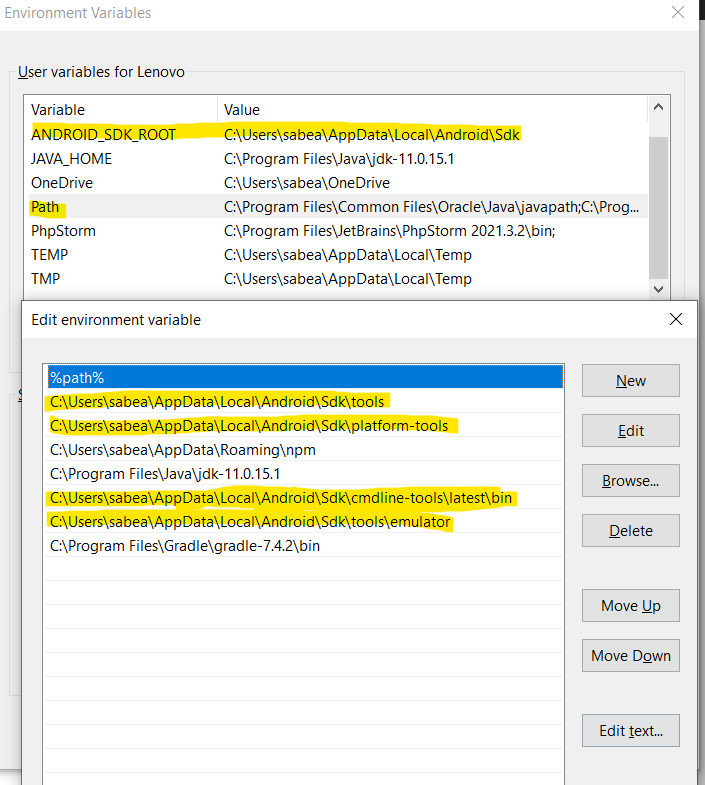

# Quasar App (quasar-builder)

A Quasar Project

## Install the dependencies
```bash
yarn
# or
npm install
```

### Start the app in development mode (hot-code reloading, error reporting, etc.)
```bash
quasar dev
```


### Lint the files
```bash
yarn lint
# or
npm run lint
```


### Format the files
```bash
yarn format
# or
npm run format
```


### Build the app for production
```bash
quasar build
```

### Customize the configuration
See [Configuring quasar.config.js](https://v2.quasar.dev/quasar-cli-webpack/quasar-config-js).

--------------------------
### Guide To Add Cordova Steps [Android/IOS] on [windows OS]
1- install cordova
```bash
$ npm install -g cordova
```
2- add cordova to quasar project
```bash
$ quasar mode add cordova
```


3.1 - To switch to the cordova project, type:
```bash
$ cd src-cordova
```
3.2 - Target platforms get installed on demand by Quasar CLI. However, if you want to add a platform manually, type:
```bash
$ cordova platform add [android|ios]
```
3.3 - To verify that everything is in order, type:
```bash
$ cordova requirements
```
4.1 - download
<a href="https://developer.android.com/studio/index.html">Android Studio</a>

4.2 - open
```bash
android studio > More action > sdk manager
```
4.3 - from `SDK Platform` tab install the android version what  you want then click apply


4.4 -  from `SDK Tools` tab uncheck `Hide Obsolete Packages` and install: <br/>
`Android SDK Command-line Tools` and `Android Emulator` and `Android SDK Tools (Obsolete)`


4.4 -  from `SDK Tools` tab check `Show Package Details` and install <br/>
`Android SDK Build-Tools`-`v30.0.3`


4.5.1 - install `JDK` from Oracle It can be found
<a href="https://www.oracle.com/technetwork/java/javase/downloads/jdk8-downloads-2133151.html">here</a>

4.5.2 - add `JAVA_HOME` to `System Environment Variables`
`C:\Program Files\Java\jdk-11.0.15.1`
```
Start menu > Edit the system environment variables > enviroment varibles.. > New...
```


4.6.1 - Gradle. It used to usable from Android Studio, but now you have to install it separately. There is a very specific version that cordova requires. You can download it
<a href="https://downloads.gradle-dn.com/distributions/gradle-4.10.3-all.zip">here</a>

for me i install last version of `gradle-7.4.2`

4.6.2 - after export it add gradle to `System Environment Variables`
```
Start menu > Edit the system environment variables > enviroment varibles.. > add to 'Path' variable
```


4.7.1 - Add this to  `System Environment Variables` After replace `<USER_NAME>`:
`ANDROID_SDK_ROOT`-`C:\Users\<USER_NAME>\AppData\Local\Android\Sdk`

4.7.2 - inside `path variable` add this After replace `<USER_NAME>`:

- `C:\Users\<USER_NAME>\AppData\Local\Android\Sdk\tools`

- `C:\Users\<USER_NAME>\AppData\Local\Android\Sdk\platform-tools`

- `C:\Users\<USER_NAME>\AppData\Local\Android\Sdk\cmdline-tools\latest\bin`

- `C:\Users\<USER_NAME>\AppData\Local\Android\Sdk\tools\emulator`



Finally, Everything is Done :)

###Run Cordova App
However, if you wish to open the IDE (Android Studio / Xcode) and from there to manually select the emulator (or multiple ones simultaneously!) to run the dev app on it/them:
```bash
$ quasar dev -m [ios|android]
```

###Build Cordova App
```bash
$ quasar build -m [ios|android]
```
